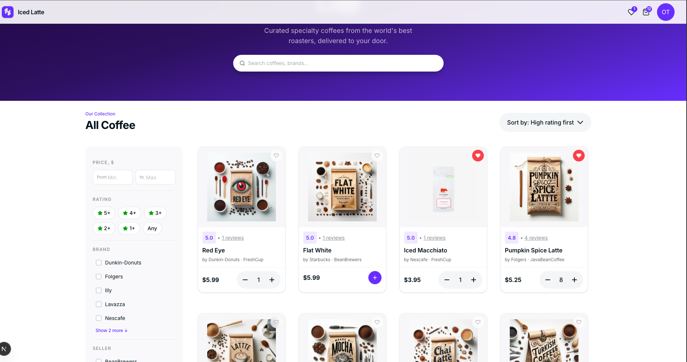

<div align="center">
  <br>
  
  <h1>Iced Latte</h1>
  <p><strong>A production-grade Java coffee marketplace — built in the open, for engineers who want real experience.</strong></p>
  <p>
    <a href="https://iced-latte.uk/">🌐 Live Demo</a> ·
    <a href="https://iced-latte.uk/backend/api/docs/swagger-ui/index.html">📖 API Docs</a> ·
    <a href="https://github.com/Sunagatov/Iced-Latte/issues?q=is%3Aopen+label%3A%22good+first+issue%22">🟢 Good First Issues</a> ·
    <a href="https://t.me/zufarexplained">💬 Community</a>
  </p>

  [](https://github.com/Sunagatov/Iced-Latte/actions)
  [](https://app.codecov.io/github/Sunagatov/Iced-Latte)
  [](LICENSE)

  [](https://github.com/Sunagatov/Iced-Latte/stargazers)
  [](https://github.com/Sunagatov/Iced-Latte/network/members)
  [](https://github.com/Sunagatov/Iced-Latte/graphs/contributors)
  [](https://hub.docker.com/r/zufarexplainedit/iced-latte-backend/)
</div>

---

**📊 Key stats across all three repositories:**

| Repository | ⭐ Stars | 🍴 Forks |
|---|---|---|
| [🔧 Backend](https://github.com/Sunagatov/Iced-Latte) |  |  |
| [🎨 Frontend](https://github.com/Sunagatov/Iced-Latte-Frontend) |  |  |
| [🧪 QA](https://github.com/Sunagatov/Iced-Latte-QA) |  |  |

> ⭐ If this project helps you learn or inspires you, please give it a star — it means a lot to the community!

---

## 🚀 Quick Start

**📋 Prerequisites:** Java 21, Maven 3.9+, Docker Desktop

```bash
# 1. 📥 Clone
git clone https://github.com/Sunagatov/Iced-Latte.git && cd Iced-Latte

# 2. 📝 Copy the example env file (all defaults work out of the box)
cp local.env .env

# 3. 🐳 Start PostgreSQL + Redis
docker-compose -f docker-compose.local.yml up -d iced-latte-postgresdb iced-latte-redis

# 4. ▶️ Run
export $(cat .env | xargs) && mvn spring-boot:run
```

🌐 App runs at `http://localhost:8083` · 📚 Swagger UI at `http://localhost:8083/api/docs/swagger-ui/index.html`

**🔐 Test login:** `olivia@example.com` / `p@ss1logic11` (15 seed users, all share this password)

> 💡 Using IntelliJ? See [START.md](START.md) for IDE run configuration, Docker-only setup, and troubleshooting.

**🧪 Run the tests:**
```bash
mvn test
```
✅ Expected: 346 tests pass, 0 failures. Tests use Testcontainers — Docker must be running.

---

## 📸 Preview

<div align="center">
  
  <p><em>Live application interface</em></p>
</div>

---

## 🤔 What is this?

Iced Latte is a non-profit sandbox project started in 2022 as a private pet project, then opened to the community to give junior engineers, students, and mentees practical experience in a real tech project with processes similar to those in actual tech teams. The first participants were students, Telegram channel subscribers, and mentees from ADPList and Women In Tech. The project has since grown and earned recognition from both the open-source community and the wider tech community.

> ⭐ If this project helps you learn or inspires you, please give it a star — it means a lot to the community!

---

## 🏆 Recognition

Iced Latte has earned recognition from the broader tech community.

**🔥 GitHub Trending 🔥 — May 22, 2024**

  - The backend repository reached GitHub's Trending page — listed among resources *"the GitHub community is most excited about today"* — gaining **85 stars in a single day** with 27 active contributors. ([link to the archive](https://archive.ph/DRsD8))

**🥉 KaiCode 2024 Finalist 🥉** 

  - Iced Latte made it to the finals of [KaiCode](https://www.kaicode.org/2024.html#jury) — an annual open-source festival launched by Huawei, which positions itself as an incubator of open-source technologies and rewards the most promising projects. Iced Latte was selected among **412 applications** and placed in the third group of 26 finalist repositories considered for the prize. Jury members are not allowed to assess their own projects, so the selection was fully independent.

**🛠️JetBrains Open Source License 🛠**

  - Iced Latte was recognized by [JetBrains](https://www.jetbrains.com/community/opensource/) — a leading software company specializing in intelligent development tools. As an active participant in the open-source community, JetBrains supports recognized global open-source projects by providing complimentary licenses for non-commercial development. JetBrains granted Iced Latte **8 free All Products Pack licenses** (February 2024, License Reference No. D379769990).

**👨💻 Recommended by Eddie Jaoude 👨**

  - Iced Latte was [recommended by Eddie Jaoude](https://www.linkedin.com/feed/update/urn:li:activity:7195685359710617602/) — one of the most influential open-source experts, a [GitHub Star](https://stars.github.com/) with 174K followers on X and 17.6K on LinkedIn — who called it a great example of a Java open-source project. Many Iced Latte contributors shared their positive experience in the comments.

---

## 🛠️ Tech Stack

| 📂 Category | 🔧 Technology |
|---|---|
| 💻 Language | Java 21 |
| 🏗️ Framework | Spring Boot 3.5, Spring Security, Spring Data JPA, Spring Retry, Spring Actuator |
| 🗄️ Database | PostgreSQL 42.7, Liquibase 4.32 |
| ⚡ Cache | Redis, Caffeine |
| 🔒 Security | JWT (JJWT 0.12), Google OAuth2, TLS |
| ☁️ Cloud | AWS S3 SDK 2.x |
| 💳 Payments | Stripe |
| 📊 Monitoring | Micrometer, Prometheus, OpenTelemetry |
| 🧪 Testing | JUnit 5, Testcontainers, REST Assured, Instancio, Jacoco |
| 📝 Logging | Logback, Logstash encoder, SLF4J |
| 📋 API | OpenAPI 3, SpringDoc 2.8, OpenAPI Generator 7 |
| 🔄 Mapping | MapStruct 1.6, Lombok |
| 🚢 Deployment | Docker, GitHub Actions |

---

## 📁 Project Structure

```
src/main/java/com/zufar/icedlatte/
├── 🔒 security/       # JWT auth, Google OAuth2, registration, login
├── 👤 user/           # User profile management
├── 📦 product/        # Product catalog
├── 🛒 cart/           # Shopping cart
├── 📋 order/          # Orders
├── ⭐ review/         # Product reviews & ratings
├── ❤️ favorite/       # Favorites list
├── 📧 email/          # Email verification & notifications
├── 📁 filestorage/    # AWS S3 file upload/download
├── 🤖 openai/         # AI integration
├── 📊 telemetry/      # Metrics & tracing endpoints
├── 🔧 common/         # Shared utilities, validation, monitoring
└── 🚀 astartup/       # Startup data migration
```

---

## 🚢 Deployment

🚫 No Kubernetes, no cloud-managed services — the app ships as a Docker container directly via SSH.

The full production setup is in [docker-compose.local.yml](docker-compose.local.yml). On every merge to `master`, [GitHub Actions](.github/workflows/dev-branch-pr-deployment-pipeline.yml) builds, tests, and deploys to production automatically. Only maintainers can merge to `master`.

🔍 Explore the [`.github/`](.github/workflows/) folder for the full CI/CD pipeline.

---

## 🤝 Contributing

🎉 Contributions are welcome. Here's how to get involved:

| 🎯 Situation | 🚀 Action |
|---|---|
| 🐛 Found a bug | [Open an issue](https://github.com/Sunagatov/Iced-Latte/issues/new) with the `bug` label |
| 💡 Want a feature | Start a [Discussion](https://github.com/Sunagatov/Iced-Latte/discussions) first |
| 👨💻 Ready to code | Pick a [`good first issue`](https://github.com/Sunagatov/Iced-Latte/issues?q=is%3Aopen+label%3A%22good+first+issue%22), comment "I'm on it" |
| 🔧 Big change | Comment on the issue before writing code — many tickets have hidden constraints |

---

### 🏷️ Issue labels

| 🏷️ Label | 📝 Meaning |
|---|---|
| 🟢 `good first issue` | Simple, well-scoped — great for first-timers |
| 🔴 `bug` | Something is broken |
| 🔵 `high priority` | Do this first |
| 🟡 `enhancement` | Accepted improvement to an existing module |
| 🟠 `new feature` | New functionality — discuss before starting |
| ⚪ `idea` | Needs design discussion — don't implement yet |

---

### 🐛 Bug reports

- 🔍 Search existing issues before opening a new one
- 📝 Clearly describe **observed** vs **expected** behaviour
- 🚀 For minor fixes, just open a PR directly

---

### 🔄 Pull requests

- 🎯 Keep PRs focused — one concern per PR
- ✅ Make sure `mvn test` passes locally before pushing
- 🔗 Reference the issue number in your PR description

---

### 🍴 Forking

🤝 Forks are welcome. Please share useful features back via PR so the community benefits and your fork stays easy to sync.

---

## 📄 License

📜 [CC BY-NC 4.0](LICENSE) — free for educational and personal use with author attribution. Commercial use requires explicit written permission from the author ([zufar.sunagatov@gmail.com](mailto:zufar.sunagatov@gmail.com)).

---

## 📞 Contact

- 💬 **Telegram community:** [Zufar Explained IT](https://t.me/zufarexplained)
- 👤 **Personal Telegram:** [@lucky_1uck](https://web.telegram.org/k/#@lucky_1uck)
- 📱 **WhatsApp:** [Message me](https://wa.me/447405503609)
- 📧 **Email:** [zufar.sunagatov@gmail.com](mailto:zufar.sunagatov@gmail.com)
- 🐛 **Issues:** [GitHub Issues](https://github.com/Sunagatov/Iced-Latte/issues)

❤️