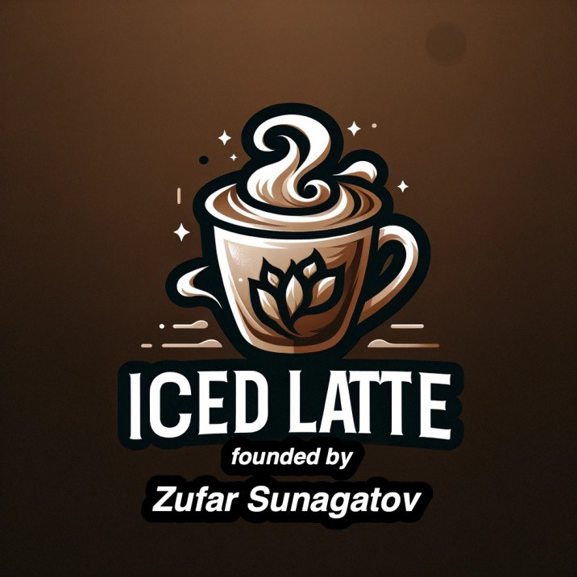

<div style="text-align: center;">
  <br>
  
  <h1>Iced Latte</h1>
  <p><strong>A production-grade Java coffee marketplace — built in the open, for engineers who want real experience.</strong></p>
  <p>
    <a href="https://iced-latte.uk/">🌐 Live Demo</a> ·
    <a href="src/main/resources/api-specs/">📖 API Specs</a> ·
    <a href="https://github.com/Sunagatov/Iced-Latte/issues?q=is%3Aopen+label%3A%22good+first+issue%22">🟢 Good First Issues</a> ·
    <a href="https://t.me/zufarexplained">💬 Community</a>
  </p>

  [](https://github.com/Sunagatov/Iced-Latte/actions)
  [](https://sonarcloud.io/project/overview?id=Sunagatov_Iced-Latte)
  [](https://app.codecov.io/github/Sunagatov/Iced-Latte)
  [](LICENSE)

  [](https://github.com/Sunagatov/Iced-Latte/stargazers)
  [](https://github.com/Sunagatov/Iced-Latte/network/members)
  [](https://github.com/Sunagatov/Iced-Latte/graphs/contributors)
  [](https://hub.docker.com/r/zufarexplainedit/iced-latte-backend/)
</div>

---

**📊 Key stats across all three repositories:**

- 🔧 [Backend](https://github.com/Sunagatov/Iced-Latte) —  · 
- 🎨 [Frontend](https://github.com/Sunagatov/Iced-Latte-Frontend) —  · 
- 🧪 [QA](https://github.com/Sunagatov/Iced-Latte-QA) —  · 

> ⭐ If this project helps you learn or inspires you, please give it a star — it means a lot to the community!

---

## 🚀 Quick Start

**📋 Prerequisites:** Java 25, Maven 3.9+, Docker Desktop

```bash
# 1. 📥 Clone
git clone https://github.com/Sunagatov/Iced-Latte.git && cd Iced-Latte

# 2. 🐳 Start infrastructure (PostgreSQL, Redis, MinIO)
docker compose --env-file .env.example up -d postgres redis minio minio-init

# 3. ▶️ Run
# Linux / macOS / Git Bash on Windows:
set -a && source .env.example && set +a && mvn spring-boot:run
```

> 🪟 **Windows (PowerShell / CMD):** the shell command above won't work as written. Use IntelliJ with `.env.example` loaded in the run configuration, or use the full Docker path instead — see [Getting Started](docs/getting-started.md).

> ⚠️ **Important:** `.env.example` is intentionally tuned for contributors: `SPRING_PROFILES_ACTIVE=dev`, optional integrations such as Stripe stay disabled, and local HTTP access logs run at `DEBUG`.

🌐 App runs at `http://localhost:8083` · 📚 Swagger UI at `http://localhost:8083/api/docs/swagger-ui/index.html`

> 💡 Using IntelliJ? See [Getting Started](docs/getting-started.md) for all four local run modes, IDE run configuration, Docker-only setup, and troubleshooting.

> 🎞️ **Want to run the frontend too?** Clone the frontend repo as a sibling and use Options 1-4 in [Getting Started](docs/getting-started.md):
> ```bash
> git clone https://github.com/Sunagatov/Iced-Latte-Frontend.git  # sibling of Iced-Latte/
> ```
> Frontend can run either locally or in Docker, depending on the mode you pick.
>
> ⚠️ Docker commands should also use `.env.example`, so the backend container starts in the same local `dev` profile unless you explicitly override it.

**🧪 Run the tests:**
```bash
mvn test
```
✅ Tests use Testcontainers — Docker must be running.

---

## 📸 Preview

<div style="text-align: center;">
  
  <p><em>Live application interface</em></p>
</div>

---

## 🤔 What is this?

Iced Latte is a non-profit sandbox project started in 2022 as a private pet project. It was later opened to the community to give junior engineers, students, and mentees practical experience in a real tech project with processes similar to those in actual tech teams. The first participants were students, Telegram channel subscribers, and mentees from ADPList and Women In Tech. The project has since grown and earned recognition from the wider developer community.

> ⭐ If this project helps you learn or inspires you, please give it a star — it means a lot to the community!

---

## 🏆 Recognition

Iced Latte has earned recognition from the broader tech community.

**🔥 GitHub Trending 🔥 — May 22, 2024**

  - The backend repository reached GitHub's Trending page — listed among resources *"the GitHub community is most excited about today"* — gaining **85 stars in a single day** with 27 active contributors. ([link to the archive](https://archive.ph/DRsD8))

**🥉 KaiCode 2024 Finalist 🥉** 

  - Iced Latte made it to the finals of [KaiCode](https://www.kaicode.org/2024.html#jury) — an annual developer festival launched by Huawei, which positions itself as an incubator of collaborative technologies and rewards promising projects. Iced Latte was selected among **412 applications** and placed in the third group of 26 finalist repositories considered for the prize. Jury members are not allowed to assess their own projects, so the selection was fully independent.

**🛠️JetBrains Open Source License 🛠**

  - Iced Latte was recognized by [JetBrains](https://www.jetbrains.com/community/opensource/) — a leading software company specializing in intelligent development tools. JetBrains granted Iced Latte **8 free All Products Pack licenses** (February 2024, License Reference No. D379769990).

**👨💻 Recommended by a GitHub Star 👨**

  - Iced Latte was [recommended in this LinkedIn post](https://www.linkedin.com/feed/update/urn:li:activity:7195685359710617602/) by a well-known creator and [GitHub Star](https://stars.github.com/), who called it a great example of a Java project. Many Iced Latte contributors shared their positive experience in the comments.

---

## 🛠️ Tech Stack

- 💻 **Language:** Java 25
- 🏗️ **Framework:** Spring Boot 4.0.5, Spring Security, Spring Data JPA, Spring Retry, Spring Actuator
- 🗄️ **Database:** PostgreSQL, Liquibase
- ⚡ **Cache:** Redis, Caffeine
- 🔒 **Security:** JWT (JJWT 0.13), Google OAuth2, Argon2
- ☁️ **Cloud:** AWS S3 SDK 2.x, CloudFront, MinIO
- 💳 **Payment:** Stripe
- 🤖 **AI:** LangChain4j, OpenAI-compatible APIs
- 📊 **Observability:** Micrometer, Prometheus, OpenTelemetry, Sentry, Loki, Datadog
- 🧪 **Testing:** JUnit 5, Testcontainers, REST Assured, Instancio, Jacoco
- 📋 **API:** OpenAPI 3, SpringDoc 3.0, OpenAPI Generator 7
- 🔄 **Mapping:** MapStruct 1.6, Lombok

---

## 📚 Guides & Features

- 📄 [Getting Started](docs/getting-started.md) — all four local run modes, IDE setup, Docker-only mode, troubleshooting
- 📄 [Infrastructure](docs/infrastructure.md) — how the database, object storage, and Redis cache are wired together, with free-tier provider options and env vars explained
- 📄 [Architecture: Feature Packaging](docs/architecture/feature-packaging.md) — modular-monolith rule: keep business code inside its owning feature package
- 📄 [Contributing](.github/CONTRIBUTING.md) — how to contribute, PR guidelines, branching
- 📄 [Security Policy](.github/SECURITY.md) — security policy and vulnerability reporting
- 📄 [Code of Conduct](.github/CODE_OF_CONDUCT.md) — community standards and expected behavior
- 📄 [LICENSE](LICENSE) — personal local evaluation only; public/educational/commercial use requires permission

---

## 📁 Project Structure

```
src/main/java/com/zufar/icedlatte/
├── 🔒 security/       # JWT auth, Google OAuth2, registration, login, sessions, rate limiting
├── 🔑 auth/           # Google OAuth2 callback, auth redirects
├── 👤 user/           # User profile, addresses, avatars
├── 📦 product/        # Product catalog, filters, images
├── 🛒 cart/           # Shopping cart
├── 📋 order/          # Orders, order lifecycle, order history
├── 💳 payment/        # Stripe payment, checkout, webhooks
├── ⭐ review/         # Product reviews, ratings, AI moderation
├── ❤️ favorite/       # Favorites list
├── 📧 email/          # Email verification & notifications
├── 📁 filestorage/    # AWS S3 / MinIO file upload/download
├── 🔧 common/         # Shared utilities, validation, monitoring, HTTP helpers
└── 🚀 astartup/       # Startup data migration and bootstrap tasks
```

---

## 🤝 Contributing

🎉 Contributions are welcome. Here's how to get involved:

- 🐛 **Found a bug:** [Open an issue](https://github.com/Sunagatov/Iced-Latte/issues/new) with the `bug` label
- 💡 **Want a feature:** start a [Discussion](https://github.com/Sunagatov/Iced-Latte/discussions) first
- 👨💻 **Ready to code:** pick a [`good first issue`](https://github.com/Sunagatov/Iced-Latte/issues?q=is%3Aopen+label%3A%22good+first+issue%22), then comment "I'm on it"
- 🔧 **Big change:** comment on the issue before writing code — many tickets have hidden constraints

---

### 🏷️ Issue labels

- 🟢 `good first issue` — simple, well-scoped, and great for first-timers
- 🔴 `bug` — something is broken
- 🔵 `high priority` — do this first
- 🟡 `enhancement` — accepted improvement to an existing module
- 🟠 `new feature` — new functionality; discuss before starting
- ⚪ `idea` — needs design discussion; don't implement yet

---

### 🐛 Bug reports

- 🔍 Search existing issues before opening a new one
- 📝 Clearly describe **observed** vs **expected** behavior
- 🚀 For minor fixes, just open a PR directly

---

### 🔄 Pull requests

- 🎯 Keep PRs focused — one concern per PR
- ✅ Make sure `mvn test` passes locally before pushing
- 🔗 Reference the issue number in your PR description

---

### 🍴 Forking

🤝 Forks are welcome. Please share useful features back via PR so the community benefits and your fork stays easy to sync.

---

## 📄 License

📜 [Iced Latte Personal Evaluation License 2026](LICENSE) — personal local evaluation only. Public, educational, remote-hosted, and commercial use require explicit written permission from the author ([zufar.sunagatov@gmail.com](mailto:zufar.sunagatov@gmail.com)).

---

## 📞 Contact

- 💬 **Telegram community:** [Project community](https://t.me/zufarexplained)
- 👤 **Personal Telegram:** [@lucky_1uck](https://web.telegram.org/k/#@lucky_1uck)
- 📱 **WhatsApp:** [Message me](https://wa.me/447405503609)
- 📧 **Email:** [zufar.sunagatov@gmail.com](mailto:zufar.sunagatov@gmail.com)
- 🐛 **Issues:** [GitHub Issues](https://github.com/Sunagatov/Iced-Latte/issues)

❤️
