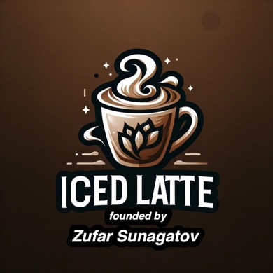

<div style="text-align: center;">
  <br>
  
  <h1>Iced Latte</h1>
  <p><strong>☕ Production-grade Java 25 / Spring Boot 4 backend for a coffee marketplace.</strong></p>
  <p>🚀 A real-world learning project with authentication, catalog, cart, orders, payments, reviews, file storage, observability, and cloud-ready infrastructure.</p>
  <p>
    <a href="https://iced-latte.uk/">🌐 Live Demo</a> ·
    <a href="docs/getting-started.md">🚀 Getting Started</a> ·
    <a href="src/main/resources/api-specs/">📖 API Specs</a> ·
    <a href="https://github.com/Sunagatov/Iced-Latte/issues?q=is%3Aopen+label%3A%22good+first+issue%22">🟢 Good First Issues</a> ·
    <a href="https://t.me/zufarexplained">💬 Community</a>
  </p>

  <p>
    <a href="https://github.com/Sunagatov/Iced-Latte/actions"></a>
    <a href="https://sonarcloud.io/project/overview?id=Sunagatov_Iced-Latte"></a>
    <a href="https://app.codecov.io/github/Sunagatov/Iced-Latte"></a>
    <a href="LICENSE"></a>
  </p>
  <p>
    <a href="https://github.com/Sunagatov/Iced-Latte/stargazers"></a>
    <a href="https://github.com/Sunagatov/Iced-Latte/graphs/contributors"></a>
    <a href="https://github.com/Sunagatov/Iced-Latte/issues?q=is%3Aopen+label%3A%22good+first+issue%22"></a>
    <a href="https://github.com/Sunagatov/Iced-Latte/issues"></a>
  </p>
  <p>
    <a href="https://hub.docker.com/r/zufarexplainedit/iced-latte-backend/"></a>
    <a href="https://hub.docker.com/r/zufarexplainedit/iced-latte-backend/"></a>
    <a href="https://github.com/Sunagatov/Iced-Latte/commits"></a>
    <a href="https://github.com/Sunagatov/Iced-Latte/pulse"></a>
  </p>
</div>

---

## 📸 Preview

<div style="text-align: center;">
  
  <p><em>Live application interface</em></p>
</div>

---

## 🏆 Recognition

Iced Latte is not just a demo repository. It has been noticed by developers, contributors, mentors, tooling companies, and open-source communities.

| Recognition | Why it matters | Proof |
|---|---|---|
| **1. 🔥 GitHub Trending**<br><sub>May 22, 2024</sub> | The backend repository reached GitHub Trending and gained **85 stars in one day** with **27 active contributors**. | [Archive](https://archive.ph/DRsD8) |
| **2. 🥉 KaiCode 2024 Finalist**<br><sub>Developer festival selection</sub> | Selected among **412 applications** for a developer festival backed by Huawei. | [KaiCode 2024](https://www.kaicode.org/2024.html#jury) |
| **3. 🛠️ JetBrains Open Source License**<br><sub>Contributor tooling support</sub> | JetBrains granted **8 All Products Pack licenses** to support contributors. | [JetBrains OSS](https://www.jetbrains.com/community/opensource/) |
| **4. 👨‍💻 Recommended by a GitHub Star**<br><sub>Community endorsement</sub> | Publicly recommended as a strong Java project example, with contributors sharing their experience. | [LinkedIn post](https://www.linkedin.com/feed/update/urn:li:activity:7195685359710617602/) |

> ⭐ These milestones show that Iced Latte is a real collaborative engineering project, not a toy example.

---

## 🤔 What is this?

Iced Latte is a non-profit sandbox project started in 2022 as a private pet project. It was later opened to the community to give junior engineers, students, and mentees practical experience in a real tech project with processes similar to those in actual tech teams. The first participants were students, Telegram channel subscribers, and mentees from ADPList and Women In Tech. The project has since grown and earned recognition from the wider developer community.

> ⭐ If this project helps you learn or inspires you, please give it a star — it means a lot to the community!

---

## 📊 Repository Ecosystem

Iced Latte is split into three focused repositories so contributors can work on backend, frontend, or QA independently.

| Repository | What it contains | Best for | Stats |
|---|---|---|---|
| 🔧 [Backend](https://github.com/Sunagatov/Iced-Latte) | Java 25, Spring Boot 4, PostgreSQL, Redis, MinIO, Stripe, OpenAPI | Backend engineers, Java learners, API contributors |   |
| 🎨 [Frontend](https://github.com/Sunagatov/Iced-Latte-Frontend) | Customer-facing marketplace web application | Frontend engineers, UI contributors, React learners |   |
| 🧪 [QA](https://github.com/Sunagatov/Iced-Latte-QA) | Test automation, quality workflows, end-to-end coverage | QA engineers, test automation learners, release-quality contributors |   |

> ⭐ If this project helps you learn or inspires you, please give it a star — it helps more contributors discover the ecosystem.

---

## 🚀 Quick Start

> 📖 **New here? Start with the [Getting Started Guide](docs/getting-started.md).**
>
> It explains every step slowly: what to install, how to run the backend, how to use IntelliJ, how to run Docker, how to connect the frontend, and what to do when something fails.

**✅ You need these installed first:**

- Java 25
- Maven 3.9+
- Docker Desktop

**⚡ Already comfortable with the terminal? Use the short path:**

```bash
git clone https://github.com/Sunagatov/Iced-Latte.git
cd Iced-Latte

docker compose --env-file .env.example up -d postgres redis minio minio-init
set -a && source .env.example && set +a && mvn spring-boot:run
```

> 🪟 On Windows PowerShell / CMD, do not copy the last command blindly. Use the [Getting Started Guide](docs/getting-started.md) instead.

🌐 App: `http://localhost:8083`<br>
📚 Swagger UI: `http://localhost:8083/api/docs/swagger-ui/index.html`

**🧪 Run the tests:**
```bash
mvn test
```
✅ Tests use Testcontainers — Docker must be running.

---

## 🛠️ Tech Stack

| Category | Technologies |
|---|---|
| 💻 **Core backend** | Java 25, Spring Boot 4.0.5, Spring Framework 7, Maven |
| 🏗️ **Application framework** | Spring Web, Spring Security, Spring Data JPA, Spring Retry, Spring Actuator |
| 🗄️ **Data layer** | PostgreSQL, Liquibase, Redis, Caffeine |
| 🔒 **Authentication & security** | JWT with JJWT 0.13, Google OAuth2, Argon2, Bouncy Castle |
| ☁️ **Storage & cloud** | AWS S3 SDK 2.x, CloudFront, MinIO |
| 💳 **Payments** | Stripe |
| 🤖 **AI features** | LangChain4j, OpenAI-compatible APIs |
| 📋 **API contract** | OpenAPI 3, SpringDoc 3.0, OpenAPI Generator 7 |
| 📊 **Observability** | Micrometer, Prometheus, OpenTelemetry, Sentry, Loki, Datadog |
| 🧪 **Testing & quality** | JUnit 5, Testcontainers, REST Assured, Instancio, Jacoco, SonarCloud, Codecov |
| 🔄 **Code generation & mapping** | MapStruct 1.6, Lombok |

---

## 📚 Guides & Features

- 📄 [Getting Started](docs/getting-started.md) — all four local run modes, IDE setup, Docker-only mode, troubleshooting
- 📄 [Infrastructure](docs/infrastructure.md) — how the database, object storage, and Redis cache are wired together, with free-tier provider options and env vars explained
- 📄 [Architecture: Feature Packaging](docs/architecture/feature-packaging.md) — modular-monolith rule: keep business code inside its owning feature package
- 📄 [Contributing](.github/CONTRIBUTING.md) — how to contribute, PR guidelines, branching
- 📄 [Security Policy](.github/SECURITY.md) — security policy and vulnerability reporting
- 📄 [Code of Conduct](.github/CODE_OF_CONDUCT.md) — community standards and expected behavior
- 📄 [LICENSE](LICENSE) — personal local evaluation only; public/educational/commercial use requires permission

---

## 📁 Project Structure

```
src/main/java/com/zufar/icedlatte/
├── 🔒 security/       # JWT auth, Google OAuth2, registration, login, sessions, rate limiting
├── 🔑 auth/           # Google OAuth2 callback, auth redirects
├── 👤 user/           # User profile, addresses, avatars
├── 📦 product/        # Product catalog, filters, images
├── 🛒 cart/           # Shopping cart
├── 📋 order/          # Orders, order lifecycle, order history
├── 💳 payment/        # Stripe payment, checkout, webhooks
├── ⭐ review/         # Product reviews, ratings, AI moderation
├── ❤️ favorite/       # Favorites list
├── 📧 email/          # Email verification & notifications
├── 📁 filestorage/    # AWS S3 / MinIO file upload/download
├── 🔧 common/         # Shared utilities, validation, monitoring, HTTP helpers
└── 🚀 astartup/       # Startup data migration and bootstrap tasks
```

---

## 🤝 Contributing

Iced Latte is built in the open and welcomes contributors who want practical experience with a real Java/Spring Boot codebase.

| I want to... | Start here |
|---|---|
| 🟢 Make my first contribution | Pick a [`good first issue`](https://github.com/Sunagatov/Iced-Latte/issues?q=is%3Aopen+label%3A%22good+first+issue%22) and comment "I'm on it" |
| 🐛 Report a bug | [Open an issue](https://github.com/Sunagatov/Iced-Latte/issues/new) with clear observed vs expected behavior |
| 💡 Suggest a feature | Start a [Discussion](https://github.com/Sunagatov/Iced-Latte/discussions) before implementation |
| 🔧 Make a larger change | Comment on the issue first so hidden constraints can be clarified |

Before opening a PR:

- 🎯 Keep the change focused on one concern
- ✅ Run `mvn test`
- 🔗 Reference the related issue
- 📖 Read the full [Contributing Guide](.github/CONTRIBUTING.md)

> ⚠️ By contributing, you agree to the project license and contribution terms described in [CONTRIBUTING.md](.github/CONTRIBUTING.md) and [LICENSE](LICENSE).

---

## 📄 License

📜 [Iced Latte Personal Evaluation License 2026](LICENSE) — personal local evaluation only. Public, educational, remote-hosted, and commercial use require explicit written permission from the author ([zufar.sunagatov@gmail.com](mailto:zufar.sunagatov@gmail.com)).

---

## 📞 Contact

- 💬 **Telegram community:** [Project community](https://t.me/zufarexplained)
- 👤 **Personal Telegram:** [@lucky_1uck](https://web.telegram.org/k/#@lucky_1uck)
- 📱 **WhatsApp:** [Message me](https://wa.me/447405503609)
- 📧 **Email:** [zufar.sunagatov@gmail.com](mailto:zufar.sunagatov@gmail.com)
- 🐛 **Issues:** [GitHub Issues](https://github.com/Sunagatov/Iced-Latte/issues)

❤️
