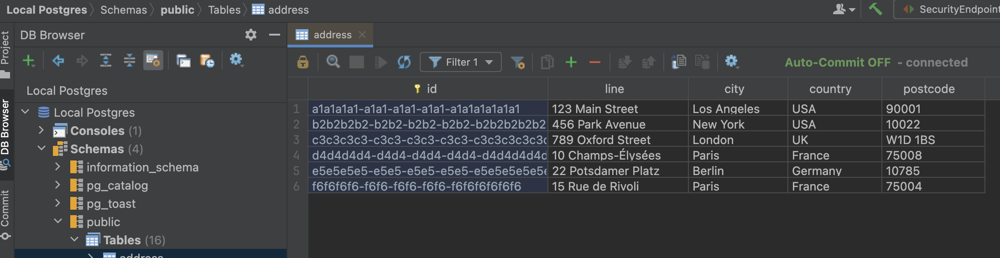

# Getting Started with the Iced Latte

Welcome to the Iced Latte! 
This guide will assist you in setting up and running the application using Docker and Docker Compose.

## Prerequisites

Ensure you have Docker Desktop installed.

## Configuration

Key variables which are used in the startup of the app. They are pre-configured for initial use, can be adjusted to tailor the app's startup settings.
- `APP_PROFILE`: Application profile (e.g., `dev`)
- `APP_VERSION`: Application version
- `APP_SERVER_PORT`: Server port for the backend service
- `DATASOURCE_URL`: JDBC URL for the PostgreSQL database
- `DATASOURCE_PORT`: Database port
- `DATASOURCE_NAME`: Database name
- `DATASOURCE_USERNAME`: Database username
- `DATASOURCE_PASSWORD`: Database password
- `REDIS_HOST`: Redis host
- `REDIS_PORT`: Redis port
- `AWS_DEFAULT_PRODUCT_IMAGES_PATH`

Refer to [docker-compose.local.yml](./docker-compose.local.yml)

## Starting the Application

### Running All Services with latest build
To start the application containers with the latest build:
```bash
docker-compose -f docker-compose.local.yml up -d --build
```

### Running All Services

To start both the backend and PostgreSQL database services as defined in the `docker-compose.yml` file:

```bash
docker-compose -f docker-compose.local.yml up -d
```

### Running only a Database (postgresql)
To start only the PostgreSQL database as defined in the docker-compose.local.yml file:
```bash
docker-compose -f docker-compose.local.yml up -d iced-latte-postgresdb
```

## Additional Docker Commands

### Rebuild containers after changes
```bash
docker-compose -f docker-compose.local.yml build
```
### Stopping Services
To stop all running containers:
```bash
docker-compose -f docker-compose.local.yml down
```

### Viewing Logs
To view logs for a specific service:
```bash
docker-compose -f docker-compose.local.yml logs [iced-latte-backend|iced-latte-postgresdb] [-f]
```

### Remove all volumes (including database data):
```bash
docker-compose -f docker-compose.local.yml down -v
```

## Database Navigator

> For Ultimate Edition consider using [Database Tools and SQL plugin](https://www.jetbrains.com/help/idea/relational-databases.html)

Install [Database Navigator](https://plugins.jetbrains.com/plugin/1800-database-navigator).

Go to **View** > **Tool Windows** > **DB Browser**.

Add new PostgresSQL connection:
 * Host `127.0.0.1`
 * Database `testdb`
 * User `postgres`
 * Password `postgres`

Enjoy!

