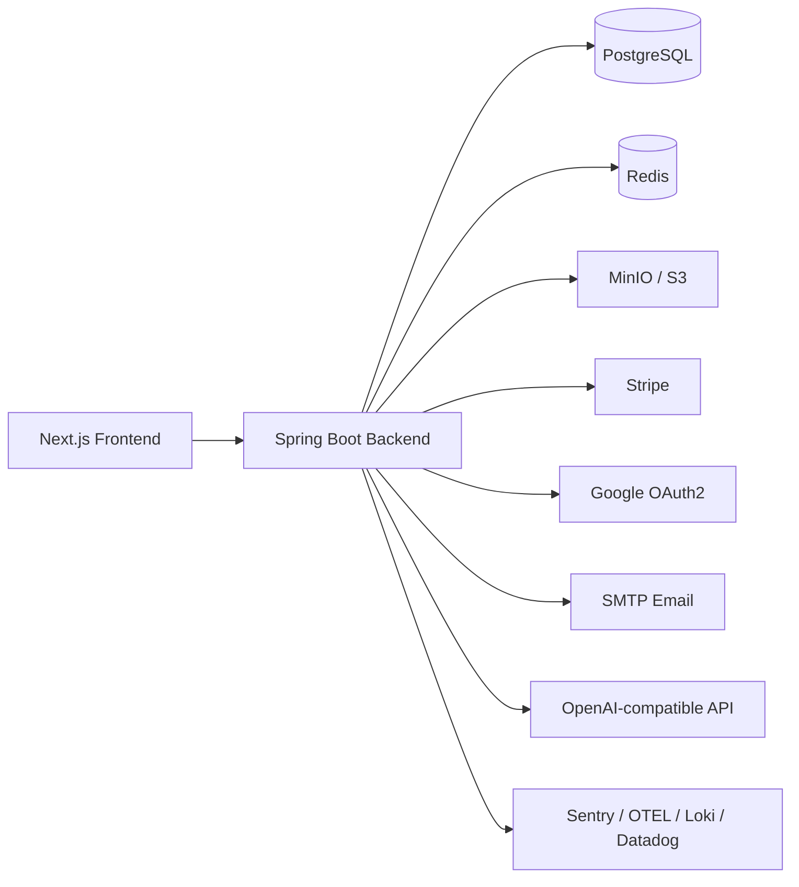

# 🧱 Infrastructure & Integrations

> **Production deployment:** production environment files, server configuration, and operations are managed outside this repository. This repository owns source code and local development workflows only. Do not add production deployment logic here.

This document explains the infrastructure used by Iced Latte: what runs locally, what each service does, which environment variables matter, and what breaks when a service is unavailable.

For local setup commands, start with [Getting Started](getting-started.md).

---

## 🗺️ Local Infrastructure Map

| Service | Local container | Port | Required for | Can the app run without it? |
|---|---|---|---|---|
| PostgreSQL | `iced-latte-postgresdb` | `5432` | users, products, carts, orders, payments, reviews, file metadata | ❌ No |
| Redis | `iced-latte-redis` | `6379` | distributed cache, rate limiting, token/session-related caches | ✅ Yes, falls back to in-memory caches |
| MinIO | `iced-latte-minio` | `9000`, console `9001` | local S3-compatible file storage | ⚠️ Partially, file/image features break if disabled |
| Backend | `iced-latte-backend` | `8083` | Spring Boot API | ❌ No |
| Frontend | `iced-latte-frontend` | `3000` | customer-facing UI | ✅ Backend can run without frontend |

Start only infrastructure:

```bash
docker compose --env-file .env.example up -d postgres redis minio minio-init
```

Start backend too:

```bash
docker compose --env-file .env.example --profile backend up -d --build
```

Start full stack:

```bash
docker compose --env-file .env.example --profile backend --profile frontend up -d --build
```

---

## 🧭 Dependency Diagram



Local contributor defaults keep optional external integrations disabled, so you can run the project without production credentials.

---

## 🔐 Local Environment Philosophy

`.env.example` is designed for contributors:

- local `dev` profile
- Swagger UI enabled
- PostgreSQL, Redis, and MinIO mapped to localhost
- Stripe, Google OAuth, email, AI, and remote observability disabled
- safe placeholder secrets for local-only use
- local access logs at `DEBUG`

Do not reuse `.env.example` secrets or placeholder values in production.

---

## 🗄️ PostgreSQL

PostgreSQL is the primary database. The schema is managed through Liquibase migrations.

### Local defaults

| Variable | Local value |
|---|---|
| `DATASOURCE_HOST` | `localhost` |
| `DATASOURCE_PORT` | `5432` |
| `DATASOURCE_NAME` | `postgres` |
| `DATASOURCE_USERNAME` | `postgres` |
| `DATASOURCE_PASSWORD` | `postgres` |
| `DATASOURCE_SSL_MODE` | `disable` |

Docker container:

```text
iced-latte-postgresdb
```

### Schema and seed data

Liquibase owns schema creation and seed data.

Profile behavior:

| Profile | Behavior |
|---|---|
| `dev` | local contributor mode; schema is recreated and seed data is loaded on restart |
| `prod` | schema is preserved; production operations are managed outside this repo |

Do not rely on a preconfigured account for manual checks. Create your own
account through Google authentication when it is configured, or sign up with an
email address and complete the email confirmation flow.

### Main tables

| Area | Tables |
|---|---|
| Users/auth | `user_details`, `user_granted_authority`, `login_attempts` |
| Addresses | `address`, `delivery_address` |
| Catalog | `product` |
| Cart | `shopping_cart`, `shopping_cart_item` |
| Orders | `order`, `order_item` |
| Reviews | `product_review`, `product_review_likes` |
| Favorites | `favorite_product`, `favorite_product_item` |
| Payments | `payment` |
| Files | `file_metadata` |
| Audit | `audit_log` |

### If PostgreSQL is down

The backend cannot start or serve normal requests. Start it with:

```bash
docker compose --env-file .env.example up -d postgres
```

---

## 📁 Object Storage: MinIO / S3-Compatible Storage

The backend uses AWS S3 SDK v2. Local development uses MinIO, but hosted environments can use AWS S3 or another S3-compatible provider.

### What is stored

| Bucket variable | Local bucket | Contents |
|---|---|---|
| `AWS_PRODUCT_BUCKET` | `iced-latte-products` | product images |
| `AWS_USER_BUCKET` | `iced-latte-users` | user avatar images |

Presigned URLs are generated per request with a 1-hour expiry and cached for 50 minutes.

### Local MinIO defaults

| Variable | Local value |
|---|---|
| `AWS_ENABLED` | `true` |
| `AWS_ENDPOINT_URL` | `http://localhost:9000` |
| `AWS_DOCKER_ENDPOINT_URL` | `http://minio:9000` |
| `AWS_PUBLIC_URL_BASE` | `http://localhost:9000/iced-latte-products` |
| `AWS_ACCESS_KEY` | `minioadmin` |
| `AWS_SECRET_KEY` | `minioadmin` |
| `AWS_REGION` | `us-east-1` |
| `AWS_PRODUCT_BUCKET` | `iced-latte-products` |
| `AWS_USER_BUCKET` | `iced-latte-users` |
| `AWS_DEFAULT_PRODUCT_IMAGES_PATH` | `./seed/products` |

MinIO console:

```text
http://localhost:9001
minioadmin / minioadmin
```

The `minio-init` container creates the required buckets automatically.

### If MinIO is down

The backend may still start, but file/image upload and image URL features will fail or degrade depending on the code path. Product image seeding may also fail.

Start MinIO with:

```bash
docker compose --env-file .env.example up -d minio minio-init
```

### Hosted S3-compatible providers

You can use:

- AWS S3
- Supabase Storage S3 API
- another S3-compatible provider

Required variables:

```text
AWS_ENABLED=true
AWS_ACCESS_KEY=<access-key>
AWS_SECRET_KEY=<secret-key>
AWS_REGION=<region>
AWS_ENDPOINT_URL=<s3-endpoint>
AWS_PUBLIC_URL_BASE=<public-url-base>
AWS_PRODUCT_BUCKET=<products-bucket>
AWS_USER_BUCKET=<avatars-bucket>
AWS_DEFAULT_PRODUCT_IMAGES_PATH=./products
```

To disable S3 entirely:

```text
AWS_ENABLED=false
```

---

## ⚡ Redis Cache

Redis improves caching and rate-limiting behavior. The backend can run without Redis because supported caches fall back to in-memory implementations.

### Local defaults

| Variable | Local value |
|---|---|
| `REDIS_HOST` | `localhost` |
| `REDIS_PORT` | `6379` |
| `REDIS_PASSWORD` | empty |
| `REDIS_SSL_ENABLED` | `false` |

Docker container:

```text
iced-latte-redis
```

### What is cached

| Cache | Key shape | TTL | Fallback |
|---|---|---|---|
| Single product | `productById::{uuid}` | 10 min | Caffeine |
| Product brands | `brands::brandNames` | 24 h | Caffeine |
| Product sellers | `sellers::sellerNames` | 24 h | Caffeine |
| S3 image URL | `imageUrl::{s3key}` | 50 min | Caffeine |
| Email verification token | `email:token:{email}` | per token TTL | Guava |
| Email send rate | `email:expiry:{email}` | per token TTL | Guava |
| JWT blacklist | `jwt:blacklist:{token}` | remaining token TTL | ConcurrentHashMap |
| Pre-auth rate limit | `rate:pre-auth:ip:{ip}` | fixed window | Caffeine |
| Post-auth rate limit | `rate:{category}:user:{userId}` or `rate:{category}:ip:{ip}` | fixed window | Caffeine |

### If Redis is down

The backend should continue running with in-memory fallbacks, but behavior is less durable across restarts and multiple backend instances.

Start Redis with:

```bash
docker compose --env-file .env.example up -d redis
```

### Managed Redis

For hosted environments, use a TCP Redis endpoint.

Example Upstash-style config:

```text
REDIS_HOST=<your-db>.upstash.io
REDIS_PORT=6380
REDIS_PASSWORD=<your-password>
REDIS_SSL_ENABLED=true
```

---

## 🔑 JWT & Auth Secrets

Local `.env.example` includes safe placeholder JWT secrets for contributor runs:

```text
APP_JWT_SECRET=...
APP_JWT_REFRESH_SECRET=...
```

Production-like deployments must use strong unique secrets and must not reuse local placeholder values.

Google OAuth is disabled locally by default:

```text
GOOGLE_ENABLED=false
```

When enabled, configure:

```text
GOOGLE_AUTH_CLIENT_ID=<client-id>
GOOGLE_AUTH_CLIENT_SECRET=<client-secret>
GOOGLE_AUTH_REDIRECT_URI=<backend-callback-url>
```

---

## 📧 Email

Email is disabled by default:

```text
EMAIL_ENABLED=false
```

When enabled, configure SMTP credentials:

```text
MAIL_USERNAME=<smtp-username>
MAIL_PASSWORD=<smtp-password>
```

Email-related features include verification and notification flows. For normal local development, keep email disabled unless you are working on that area.

---

## 💳 Stripe

Stripe is disabled by default:

```text
STRIPE_ENABLED=false
```

When working on payments, use test mode only:

```text
STRIPE_SECRET_KEY=sk_test_...
STRIPE_WEBHOOK_SECRET=whsec_...
```

Do not use live keys or real card details in local development.

Related design reference:

- [Stripe Payment Integration — System Design Guide](stripe-payment-guide.md)

---

## 🤖 AI / OpenAI-Compatible APIs

AI features are disabled by default:

```text
AI_ENABLED=false
```

When enabled, configure:

```text
SPRING_AI_OPENAI_API_KEY=<api-key>
AI_BASE_URL=<openai-compatible-base-url>
AI_MODEL_NAME=<model-name>
```

Keep AI disabled unless you are working on review summaries or AI-assisted behavior.

---

## 📊 Observability

Local contributor runs do not require remote observability.

Disabled by default:

| Area | Variables |
|---|---|
| Sentry | `SENTRY_ENABLED`, `SENTRY_DSN`, `SENTRY_ENVIRONMENT` |
| Loki | `LOKI_ENABLED`, `LOKI_URL` |
| Logstash | `LOGSTASH_ENABLED`, `LOGSTASH_HOST`, `LOGSTASH_PORT` |
| Datadog | `DATADOG_ENABLED`, `DD_API_KEY` |
| OpenTelemetry | `OTEL_EXPORTER_ENABLED`, `OTEL_COLLECTOR_BASE_URL`, `MANAGEMENT_*` |
| Pyroscope | `PYROSCOPE_ENABLED` |

The optional `monitoring` Docker Compose profile includes a Datadog agent:

```bash
docker compose --env-file .env.example --profile monitoring up -d
```

Only enable observability integrations when you intentionally work on monitoring or diagnostics.

---

## 🧪 Quick Health Checks

Use these commands when something looks broken:

```bash
docker ps
docker compose logs -f backend
docker compose logs -f postgres
docker compose logs -f redis
docker compose logs -f minio
```

Open:

| Tool | URL |
|---|---|
| Backend | http://localhost:8083 |
| Swagger UI | http://localhost:8083/api/docs/swagger-ui/index.html |
| MinIO console | http://localhost:9001 |

---

## 🔗 Related Docs

- [Getting Started](getting-started.md)
- [Feature Packaging Rule](architecture/feature-packaging.md)
- [Stripe Payment Integration — System Design Guide](stripe-payment-guide.md)
- [Security Policy](../.github/SECURITY.md)
